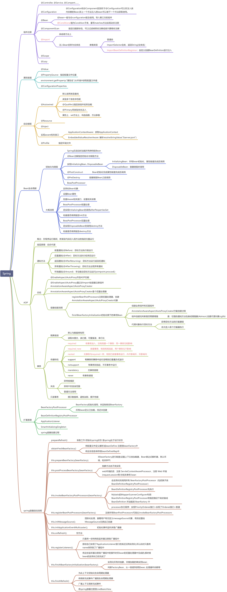

# 🎨 写在前面

> <b>说明</b>：本站构建工具[docsify](https://docsify.js.org/#/)。 本站源码:[GitHub](https://github.com/tyc1210/tyc1210.github.io)、[Gitee](https://gitee.com/tyc12345/docs)

* ⏳ `We'll find a way; we always have.`
* ✨ 19年毕业，普通本科。自学的java编程。本网站用来记录和分享个人的学习笔记、资料、一些常用工具等，希望可以帮到正在努力的你！`peace & love`

---

# 🔑 同款博客
---
**所需工具:docsify、githup**
- 按照[docsify](https://docsify.js.org/#/zh-cn/)官方文档，先在本地启动起来。
- 登录githup创建仓库，仓库名为：你在githup上的用户名+.github.io 例如我用户名为tyc1210 仓库名为tyc1210.github.io
- 将你本地docs下的文件上传到githup上去
- 点击setting,找到pages,选中分支master,文件夹root，保存即可专看到属于你的网址了

---
# ☕ 学习导航
---

## 🚀 计算机基础
- [计算机网络](https://www.yuque.com/docs/share/ed37deee-02db-4512-8a12-ec76c6b10d2b)

---

## ☕️ Java
- **【一】Java基础**
	- [值传递 or 引用传递？](https://www.zhihu.com/question/31203609)
	- [解锁多种获取对象的技巧](https://mp.weixin.qq.com/s/aZg9SZT3DWkCkEsjlUjTtQ)
	- [List](https://mp.weixin.qq.com/s/9bw2-pkuYSKEnstb4KGsqQ)
	- [HashMap](https://mp.weixin.qq.com/s/xv0GmAU8fVlS_sxWKWUWYw)
	- [代码规范](https://www.yuque.com/tyc-cc/tp08p3/rfmb0k)
	
- **【二】多线程**
	- [中断](/Java/中断.md)
	- [ThreadLocal](/Java/ThreadLocal.md)
	- [线程等待与唤醒](/Java/线程等待与唤醒.md)
	- [守护线程](/Java/守护线程.md)
	- [HashMap线程不安全](https://baijiahao.baidu.com/s?id=1675991555833901875&wfr=spider&for=pc)
	- [ConcurrentHashMap](https://mp.weixin.qq.com/s/cnpfLL4TeL2oyEcHia6Bmg)
	- [AQS](https://www.cnblogs.com/waterystone/p/4920797.html)
- **【三】JVM**
	- [Alibaba开源的Java诊断工具-Arthas](https://arthas.aliyun.com/doc/)
	- [线上CPU飙升与死锁排查](https://www.yuque.com/docs/share/d8a0d0e3-4840-4c73-901a-c22b363040ea)
	- [《深入理解java虚拟机》总结(密码:cw0n)](https://www.yuque.com/docs/share/1e59af64-05e6-45cc-a7b7-beb4d3e0b2da)

---

## 🍿 Spring全家桶
- [springboot整合大全](https://zhuanlan.zhihu.com/p/145063307)
- [spring系列框架](https://www.r2coding.com/#/?id=spring%e7%b3%bb%e5%88%97%e6%a1%86%e6%9e%b6)

---

## 📜 数据库
- [批量插入](https://mp.weixin.qq.com/s/bghdFtuv6TT2s-mqDECnqQ)
- [mysql数据恢复](/Mysql/mysql数据恢复.md)
- [mysql更新流程.md](/Mysql/mysql更新流程.md)
- [索引和优化](/Mysql/索引和优化.md)

---

## 🔗 MQ/服务器
- **Reids**
	* [一致性Hash算法](https://blog.csdn.net/bntX2jSQfEHy7/article/details/79549368)
- **Kafka**
	- [kafka入门指南](https://mp.weixin.qq.com/s/bUNAD2fkGTD73jVLw8rDHg)
	- [从面试的角度学习kafka](https://mp.weixin.qq.com/s/o-rqnOH4FHeHaz0VqoHnFg)
	- [消息丢失](/Kafka/消息丢失.md)
- Zookeeper
	- [十二连问](https://mp.weixin.qq.com/s/ir0uurwo95hB3g__vTceJQ)
- **RabbitMq**
	* [常见问题](/RabbitMQ/rabbitmq.md)	
- **Dubbo**
	- [Dubbo知识点总结](https://mp.weixin.qq.com/s/2qSA6aJn6KRXrATVE44k0w)	
- **Nginx**
	- [nginx配置详解](https://mp.weixin.qq.com/s/099PJZE89JVNnaF0kwePDQ)
	- [Nginx工作原理（Master+Worker）](https://www.cnblogs.com/yblackd/p/12194143.html)	
	- [Nginx为什么这么快](https://mp.weixin.qq.com/s/VR1jEhJVXCfja3Pmo_kKkw)
	
---

## 🐧 linux
- [文档教程](http://billie66.github.io/TLCL/book/)

---

## ☁️ 云原生
- [docker基础](/Docker/basic.md)
- [云原生](https://www.yuque.com/leifengyang/oncloud/ctiwgo)

---

## 💭 设计模式
- [个人笔记](https://www.yuque.com/tyc-cc/hgythh/lys8gy)

---

## 💻 网络编程
- [计算机网络基础整理](https://www.yuque.com/docs/share/ed37deee-02db-4512-8a12-ec76c6b10d2b)
- [netty笔记](https://www.yuque.com/docs/share/061d6311-a729-4eb0-8a66-03954d9f40ac)

---

## ⏳ 数据结构与算法
-[算法小抄](https://labuladong.gitee.io/algo/)

---
## 🔧 版本控制
- [git基础](https://www.yuque.com/docs/share/0f11808d-9097-4e86-b016-5cfa207aaa6e)
- [多账号管理](https://blog.csdn.net/thewindkee/article/details/88552357?utm_medium=distribute.pc_relevant.none-task-blog-2~default~baidujs_title~default-1.no_search_link&spm=1001.2101.3001.4242.2)

---
## ✏️ 前端
- [vue笔记](/Vue/Vue.md)
- [跨域处理](https://blog.csdn.net/wh_xmy/article/details/87705840)
- [基于VUE2.0的IM 聊天组件](https://gitee.com/june000/lemon-im)

---
## 🐍 Python
- [python笔记](/Python/basic.md)
- [爬虫基础](https://gitee.com/tyc12345/pc)

---

## 🎁 脑图整理
!> 以下脑图为本人整理，部分还有待补充，仅适用于个人。参考：书籍、视频、博客。

   <!-- tabs:start -->

   #### **并发编程**

   🙄图片加载太慢 ➡️➡️➡️[点我查看源文件](https://www.yuque.com/docs/share/e35fc0eb-c196-45af-96f9-6feff6462bf8?#%20%E3%80%8A%F0%9F%93%96%20java%E5%B9%B6%E5%8F%91%E7%BC%96%E7%A8%8B%E7%9A%84%E8%89%BA%E6%9C%AF%E3%80%8B)	

   

   #### **java虚拟机**

   🙄图片加载太慢 ➡️➡️➡️[点我查看源文件](https://www.yuque.com/docs/share/e83eb506-bcd4-4f62-b522-7598972116e6?)

   

   #### **Spring**
   🙄图片加载太慢 ➡️➡️➡️[点我查看源文件](https://www.yuque.com/docs/share/6234de51-4688-4381-a249-926f1ddb6def?)	
	
	
   

   <!-- tabs:end -->

---

# 🎅 联系作者

微信

		

